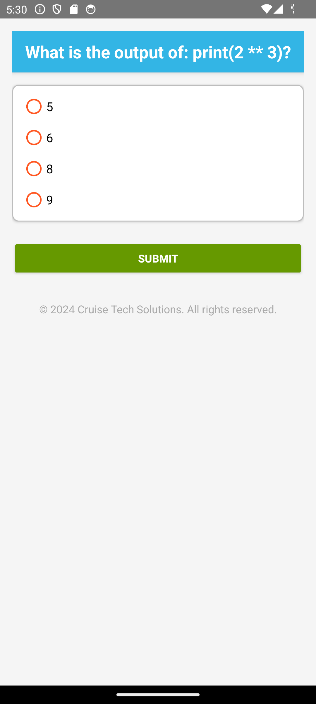

# Python Quiz App

## Overview
The Python Quiz App is an Android-based quiz application that tests the user's knowledge of the Python programming language. It provides multiple-choice questions on various Python topics and tracks the user's score. The app also displays the correct answers after completing the quiz.

**Note:** This app is still under development. Collaborators are welcome to join and contribute to the project.

## Features

### Multiple-choice questions
The app asks Python-related questions with four possible answers for each.

### Score tracking
The app tracks and displays the user's score at the end of the quiz.

### Question review
The app shows the correct answers for each question after the quiz ends.

### Restart functionality
Users can restart the quiz and retake it.

## Screenshots

### Home Screen

### Results Screen

## Technologies

### Kotlin
The app is built using Kotlin for Android development.

### Android Studio
The development environment used to build the app.

### XML
Used for designing the layout.
